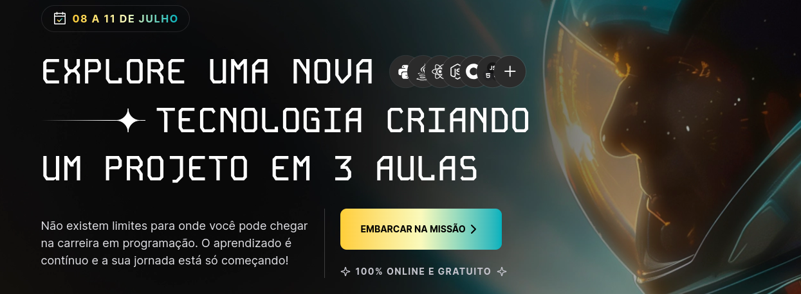
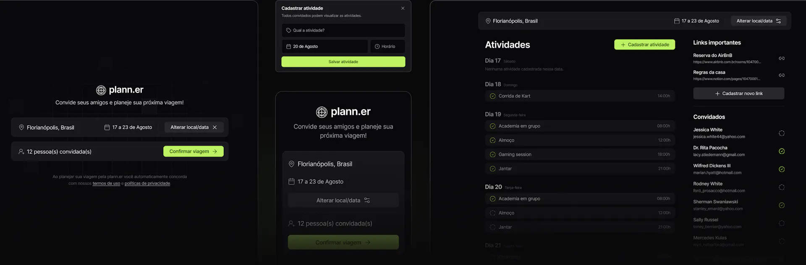

<p align="center">
  <a href="https://www.rocketseat.com.br/eventos/nlw" target="_blank">
    
  </a>
</p>
<p align="center">	
<a href="https://www.linkedin.com/in/bruno-bach/">
  
  </a>
  

  <a href="https://github.com/brunobach/nlw-journey/commits/master">
    
  </a> 
  
   <a href="https://github.com/brunobach/nlw-journey/stargazers">
    
  </a>
</p>

# NLW journey (Go)
Pra você que deseja desenvolver aplicações de alta performance e escalabilidade, com foco em programação back-end e serviços distribuídos. Explore uma linguagem robusta e eficiente.

## OK, mas o que é o NLW?
> O MAIOR EVENTO DE PROGRAMAÇÃO NA PRÁTICA DA GALÁXIA!

Essa é a 16ª edição do **Next Level Week**, uma semana de aulas com muito código, desafios e networking com um único objetivo: te levar para o próximo nível, seja qual for seu momento de carreira.

- +400 mil devs impactados
- +2.4 M de visualizações nas aulas
- +600 horas de vídeo assistidas

### Participe do NLW se você quer

| 01 | 02 | 03 | 04 |
|----|----|----|----|
| Iniciar seus estudos e sua carreira em programação |  Ampliar o seu portfólio com um novo projeto |  Explorar uma nova tecnologia na prática |  Se atualizar e descobrir novas ferramentas |


### Vamos desenvolver do um planejador de viagem 
<p align="center">
  
</p>

### Trilhas do evento
| Trilha | Nível | Instrutor |
|--------|-------------|-----------|
|HTML+CSS+JS| `INICIANTE` | [Maik Brito](https://maykbrito.dev/) |
|React| `INTERMEDIÁRIO` | [Diego Fernandes](https://github.com/diego3g) |
|React Native| `INTERMEDIÁRIO` | [Rodrigo Gonçalves](https://github.com/orodrigogo) |
|Java| `INTERMEDIÁRIO` | [Fernanda Kipper](https://github.com/orodrigogo) |
|Python| `INTERMEDIÁRIO` | [Rafael Ferreira](https://www.youtube.com/@ProgramadorLhama) |
|C#| `INTERMEDIÁRIO` | [Welisson Arley](https://github.com/welissonArley) |
|Node.js| `INTERMEDIÁRIO` | [Diego Fernandes](https://github.com/diego3g) |
|DevOps| `AVANÇADO` | [Daniel Rodrigues](https://github.com/eusouodaniel) |
|IA| `INTERMEDIÁRIO` | [Daniel Omar](https://br.linkedin.com/in/daniel-omar-soria) |
|GO| `INTERMEDIÁRIO` | [Pedro Pessoa](https://www.youtube.com/@phenpessoa) |


### Um pouco sobre a trilha de Go

| Aulas | Descrição | Acessar |
|---------|-----------|------|
| `Segunda-Feira, 08/07 • 20h00` | Nessa primeira aula, além de conhecermos o projeto, vamos colocar a mão na massa e dar os primeiros passos no desenvolvimento do projeto. Hoje é dia de preparar o seu ambiente de desenvolvimento, dominar os fundamentos dessa tecnologia para criar uma base sólida que estará presente no projeto que vamos desenvolver. | [Assistir](https://app.rocketseat.com.br/events/nlw-journey/go/aula-01-go) |
| `Terça-Feira, 09/07 • 8h00` | Nessa segunda aula vamos avançar no desenvolvimento do projeto, e juntos, vamos acelerar o se aprendizado: aprender enquanto desenvolve um projeto é o caminho mais rápido para ganhar experiência na tecnologia além de conhecer as possibilidades dessa tecnologia poderosa! | [Assistir](https://app.rocketseat.com.br/events/nlw-journey/go/aula-01-go) |
| `Quarta-Feira, 10/07 • 8h00` | O seu próximo nível está próximo. Hoje vamos fazer os últimos ajustes no projeto e finalizar as funcionalidades para concluir a missão. Ao final, você poderá adicionar esse projeto incrível no seu portfólio. | [Assistir](https://app.rocketseat.com.br/events/nlw-journey/go/aula-01-go) |


### Requisitos

- [Go](https://golang.org/)
- [Docker](https://www.docker.com/)
- [Docker Compose](https://docs.docker.com/compose/)
- [Make](https://www.gnu.org/software/make/)
- [Tern](github.com/jackc/tern/v2@latest)
- [goapi-gen](https://github.com/discord-gophers/goapi-gen)
- [Sqlc](https://github.com/sqlc-dev/sqlc)
- [OpenAPI - NLW journey](https://nlw-journey.apidocumentation.com/reference)
- [Editor Swagger](https://editor.swagger.io/)

### Comandos utilizados
| Ferramenta | Comando |
|------------|---------|
| goapi-gen | `go install github.com/discord-gophers/goapi-gen@latest`|
| Tern | `go install github.com/jackc/tern/v2@latest`|
| Sqlc | `go install github.com/sqlc-dev/sqlc/cmd/sqlc@latest`|

### Como executar o projeto

```bash
# Clone este repositório
$ git clone

# Acesse a pasta do projeto
$ cd nlw-journey-go

# Execute o comando para subir o container postgres
$ docker-compose up

# Execute o comando para gerar o arquivo .env
$ cp .env.example .env

# Execute o comando para rodar as migrations
$ make migrate-up

```